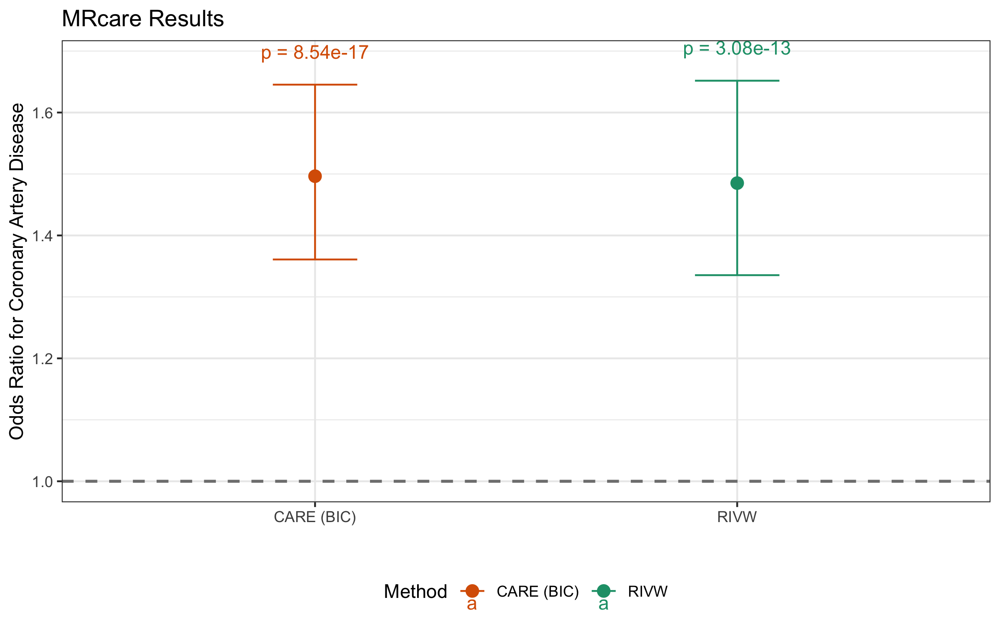
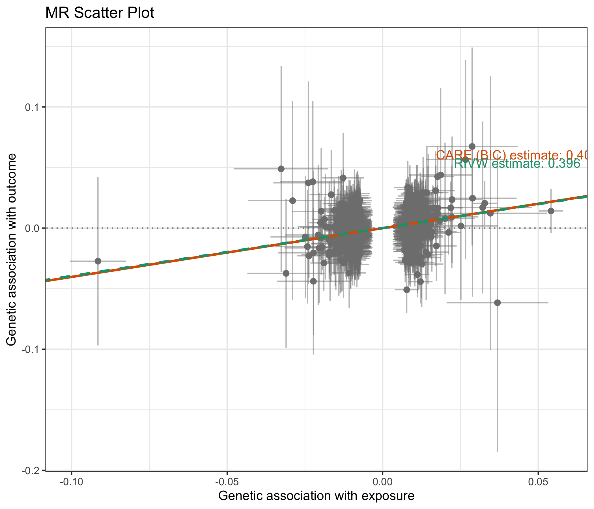
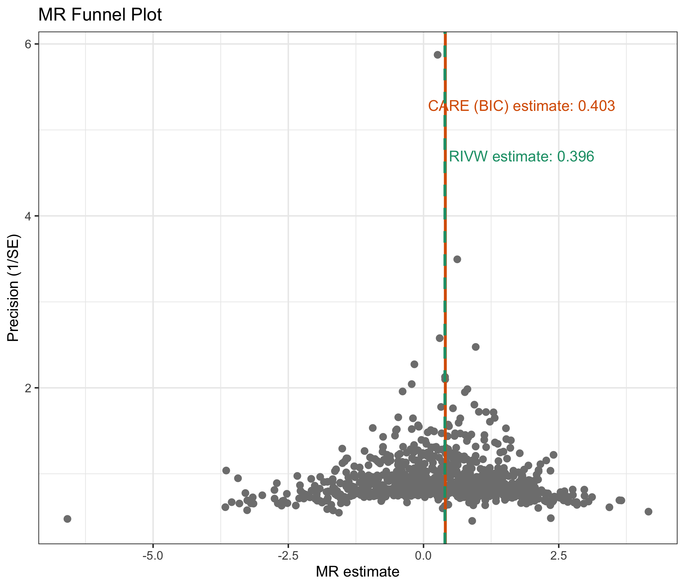

# MRcare: Robust Mendelian Randomization through Causal Analysis with Randomized Estimators (CARE) 
[](https://CRAN.R-project.org/package=MRcare)
[](https://lifecycle.r-lib.org/articles/stages.html#stable)

## Overview

Mendelian Randomization (MR) is a powerful approach for estimating causal effects of modifiable exposures on health outcomes using genetic variants as instrumental variables. MRcare implements the Causal Analysis with Randomized Estimators (CARE) method, which addresses three major challenges in MR studies:

1. **Horizontal pleiotropy**: When genetic variants affect the outcome through pathways other than the exposure
2. **Winner's curse bias**: Inflation of effect sizes when the same data is used for both instrument selection and effect estimation
3. **Measurement error bias**: Errors in estimated genetic associations with the exposure

Unlike traditional MR methods, CARE delivers reliable causal inference even when these biases are present, providing more accurate estimates with improved statistical power.

Additionally, MRcare implements the Rerandomized Inverse Variance Weighted estimator (RIVW), which systematically corrects for winner's curse, leading to unbiased association effect estimates for the selected genetic variants under valid instrumental variable assumptions.

## Installation

You can install the released version of MRcare from CRAN with:

```r
install.packages("MRcare")  # Coming soon
```

Or install the development version from GitHub:

```r
# install.packages("remotes")
remotes::install_github("yourgithub/MRcare")
```

## Setup

Before using MRcare for analysis, you need to configure the package with required resources:

```r
library(MRcare)
configure_mrcare()
```

This one-time configuration will:
- Check for PLINK 1.9 installation (downloading it if needed)
- Download reference panels for linkage disequilibrium (LD) calculations
- Save the configuration for future sessions

By default, European ancestry (EUR) data from the 1000 Genomes Project is used. You can specify a different ancestry:

```r
configure_mrcare(ancestry = "AFR")  # African ancestry
```

If you already have PLINK 1.9 and reference panels installed:

```r
configure_mrcare(
  plink_path = "/path/to/plink",
  ref_panel_path = "/path/to/reference/panel"
)
```

## Data Preparation

MRcare requires preprocessed GWAS summary statistics for both the exposure and outcome:

```r
# Preprocess exposure GWAS data
exposure_processed <- preprocess_gwas_data(
  gwas_data = "raw_exposure_gwas.txt", 
  output_file = "processed_exposure.txt",
  data_type = "exposure",
  Ninput = 10000  # Optional: specify sample size if not in the data
)

# Preprocess outcome GWAS data
outcome_processed <- preprocess_gwas_data(
  gwas_data = "raw_outcome_gwas.txt", 
  output_file = "processed_outcome.txt",
  data_type = "outcome"
)
```

The preprocessing function standardizes column names, performs quality control, and prepares data for MR analysis:
- Detects and standardizes column names from common GWAS formats
- Removes variants with missing values
- Filters strand-ambiguous SNPs to avoid alignment issues
- Applies minor allele frequency (MAF) filtering
- Removes duplicated SNPs

## Running MR-CARE Analysis

The main function `mr_care()` performs Mendelian randomization analysis using the CARE method:

```r
# Basic usage with default parameters
results <- mr_care(
  exposure_data = "processed_exposure.txt",
  outcome_data = "processed_outcome.txt"
)

# Advanced usage with custom parameters
results <- mr_care(
  exposure_data = "processed_exposure.txt",
  outcome_data = "processed_outcome.txt",
  bias_correction = "rerand",  # Correction for winner's curse
  algorithm = "CD",            # Coordinate descent algorithm
  p_threshold = 5e-5,          # Significance threshold for selecting IVs
  nrep = 5000,                 # Number of bootstrap repetitions
  clump_r2 = 0.001,            # LD clumping r² threshold
  clump_kb = 10000             # LD clumping window size in kb
)
```

### Key Parameters

We recommend using the default settings unless there is a strong reason to modify these parameters:

| Parameter | Description | Recommended Value |
|-----------|-------------|------------------|
| `bias_correction` | Method for correcting winner's curse bias | `"rerand"` (re-randomization) |
| `algorithm` | Algorithm for pleiotropy detection | `"CD"` (coordinate descent) |
| `p_threshold` | Significance threshold for selecting genetic variants | `5e-5` |
| `nrep` | Number of bootstrap repetitions | `5000` |
| `clump_r2` | LD clumping r² threshold | `0.001` |
| `clump_kb` | LD clumping window size | `10000` |

## Understanding the Results

The `mr_care()` function returns a comprehensive results object with causal effect estimates:

```r
# Display a summary of the results
print(results)

# Access specific result components
results$BIC       # Results from BIC-selected model (recommended)
results$RIVW      # Results from RIVW estimator
results$metadata  # Analysis metadata
```

### Result Components

For both the BIC and RIVW methods, the following statistics are provided:

- **estimate**: The estimated causal effect
- **efron_se**: Standard error (from Efron's bootstrap for BIC)
- **efron_p**: P-value for the causal effect
- **ci_lower/ci_upper**: Confidence interval bounds (via summary function)
- **valid_count**: Number of valid instruments identified (BIC)
- **nIV**: Number of instruments used (RIVW)

### Interpreting Results

The summary function provides a clear overview of:
- Analysis parameters and metadata
- Instrument strength (F-statistic)
- Valid and invalid instrument counts
- Causal effect estimates with confidence intervals

The BIC method is recommended as it provides robust causal inference by accounting for horizontal pleiotropy, winner's curse, and measurement error simultaneously.

## Visualizing Results

MRcare provides intuitive visualization functions:

```r
# Forest plot of BIC and RIVW estimates
plot_care(results)

# Scatter plot of exposure vs outcome effects
plot_scatter(results, highlight_invalid = TRUE)

# Funnel plot to assess potential pleiotropy
plot_funnel(results)

# Combined visualization (all three plots)
plot_combined(results)
```

### Customizing Visualizations

Each plotting function accepts parameters for customization:

```r
# Customize forest plot for odds ratios
plot_care(
  results,
  exponentiate = TRUE,    # For odds ratios
  ci_level = 0.95,        # Confidence level
  xlab = "Odds ratio",    # X-axis label
  title = "Causal effect of exposure on outcome"
)

# Customize scatter plot
plot_scatter(
  results,
  highlight_invalid = TRUE,  # Highlight invalid instruments
  xlab = "Effect on exposure",
  ylab = "Effect on outcome",
  title = "MR Scatter Plot"
)
```

## Technical Details

### The CARE Method

CARE addresses horizontal pleiotropy through an ℓ₀-constrained optimization framework that identifies and accounts for invalid instruments. It employs Coordinate Descent algorithm to efficiently identify valid instruments.

CARE addresses winner's curse bias through re-randomization approaches while accounting for measurement error in the exposure effect estimates and invalid instrumental varaibels. The method employs bootstrap aggregation (bagging) and non-parametric delta method to reduce screening variability and valid statistical inference.

### Key Advantages of CARE

1. **Robust to widespread pleiotropy**: CARE does not require balanced pleiotropy assumptions
2. **Corrects for winner's curse bias**: Enables use of more liberal p-value thresholds for IV selection
3. **Accounts for measurement error**: Reduces bias in causal effect estimates
4. **Provides valid statistical inference**: Maintains validity even when IV screening is imperfect
5. **Computationally efficient**: Core algorithms implemented in C++ for performance

## Quick Example: BMI → Coronary Artery Disease

Here's a complete example analyzing the causal effect of Body Mass Index (BMI) on Coronary Artery Disease (CAD) using pre-processed GWAS summary statistics:

```r
# Load required libraries
library(MRcare)
library(ggplot2)

# First-time setup (run once)
configure_mrcare()

# Download pre-processed GWAS data
exposure_url <- "https://huggingface.co/datasets/kunrzzz/mrcare-quickstart-data/resolve/main/bmi_exposure_for_mrcare.txt"
outcome_url <- "https://huggingface.co/datasets/kunrzzz/mrcare-quickstart-data/resolve/main/cad_outcome_for_mrcare.txt"

download.file(exposure_url, destfile = "bmi_exposure_data.txt")
download.file(outcome_url, destfile = "cad_outcome_data.txt")

# Run MR-CARE analysis
results <- mr_care(
  exposure_data = "bmi_exposure_data.txt",
  outcome_data = "cad_outcome_data.txt",
  p_threshold = 5e-5
)

# View results
print(results)
```

### Example Results

The analysis provides causal effect estimates from both BIC-selected and RIVW methods:

```
===================================================================
 MRcare: Causal Analysis Robust to plEiotropy for Mendelian Randomization
===================================================================

Analysis Details:
- Exposure sample size: 461,460
- Outcome sample size: 184,305  
- Total significant SNPs: 228,477
- Independent variants selected: 985
- Final harmonized instruments: 899
- Analysis time: 2.44 minutes

CAUSAL EFFECT ESTIMATES:
Method          Estimate        S.E.            P-value
----------------------------------------------------------------
CARE (BIC):     0.4031          0.0484          8.5444e-17
RIVW:           0.3955          0.0542          3.0774e-13
----------------------------------------------------------------

BIC-selected Model (Recommended):
- Causal estimate: 0.403 
- Standard error: 0.048
- P-value: 8.54e-17
- Valid instruments: 899/899
- Odds ratio: 1.50 (per unit BMI increase)

RIVW Estimator:
- Causal estimate: 0.396
- Standard error: 0.054  
- P-value: 3.08e-13
- Instruments used: 899
- Odds ratio: 1.49 (per unit BMI increase)
```

### Visualization

Generate publication-ready plots to visualize your results:

```r
# Forest plot comparing estimates (with odds ratios for disease outcomes)
forest_plot <- plot_care(results, exponentiate = TRUE, xlab = "Odds Ratio for CAD")
ggsave("mrcare_forest_plot.png", plot = forest_plot, width = 8, height = 5)

# Scatter plot showing instrument effects
scatter_plot <- plot_scatter(results, highlight_invalid = TRUE)
ggsave("mrcare_scatter_plot.png", plot = scatter_plot, width = 7, height = 6)

# Funnel plot for pleiotropy assessment
funnel_plot <- plot_funnel(results)
ggsave("mrcare_funnel_plot.png", plot = funnel_plot, width = 7, height = 6)
```

**Forest Plot**: Comparison of causal effect estimates
<p align="center">

</p>

**Scatter Plot**: Genetic instrument effects on exposure vs. outcome
<p align="center">

</p>

**Funnel Plot**: Assessment of horizontal pleiotropy
<p align="center">

</p>

### Interpretation

The results provide strong evidence for a causal effect of BMI on coronary artery disease risk. Each unit increase in BMI (kg/m²) is associated with approximately a 50% increase in CAD odds (OR ≈ 1.50). 

## References

For detailed information about the CARE method, please refer to:

```
@article{author2025winners,
  title={Winner's Curse Free Robust Mendelian Randomization with Summary Data},
  author={Anonymous authors (placehoder)},
  journal={Journal (placeholder)},
  year={2025}
}
```

## Getting Help

For questions, bug reports, or feature requests, please visit our GitHub repository:
[https://github.com/yourgithub/MRcare/issues](https://github.com/yourgithub/MRcare/issues)

## License

This package is licensed under GPL (>= 3).
